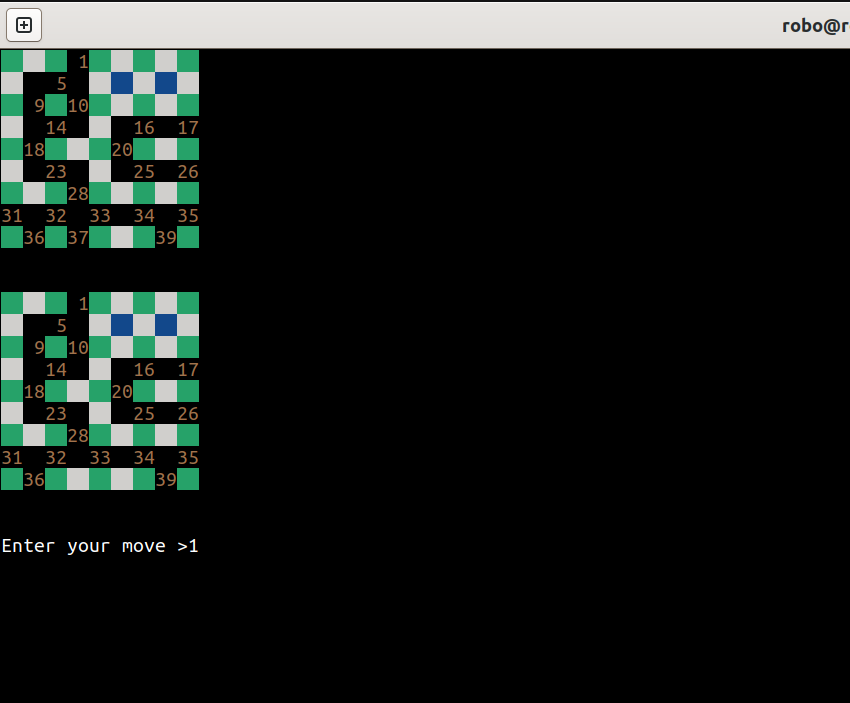

# DotGame (Dots and Boxes)

Creating a popular game we play on paper and creating agents to play it perfectly.




---


## 🧠 Agents Implemented

Agents are modular and located in `agents/`:
- **Tabular Q-Learning** (`tabular_q.py`)
- **Deep Q-Network (DQN)** (`dqn.py`)
- **Minimax** (`minmax.py`)
- **Monte Carlo Tree Search (MCTS)** (`mcts.py`)
- **AlphaZero-style Agent** (`alphazero.py`)  
  Uses MCTS guided by policy/value neural networks.


---


## Directory Structure

DotGame/<br/>
├── agents/ #All agent implementations<br/>
├── env/ #DotGame environment<br/>
├── legacy/ #Old C implementation<br/>
├── trained_models/ #Saved model files<br/>
├── plots/ #Plots saved here after play<br/>
├── train.py #Main training entry point<br/>
├── play.py #Main evaluation entry point<br/>
└── requirements.txt #Libraries used<br/> 
└── README.md #This file<br/>


---


## Usage

### Install dependencies
```bash
pip install -r requirements.txt
```

### Train an agent 

```bash
python3 -m train --dots 3 --agent mcts --epochs 400000
```

Supported agents: qt, dqn, mcts, alphazero

### Play bw agents

```bash
python3 -m play --dots 4 --agent1 self --agent2 alphazero --games 1
```

self = user input<br/>
win-loss rate would automatically be plotted after games at plots/


---


Legacy: legacy/dotgame.c

```bash
gcc dotgame.c
./a.out
```

